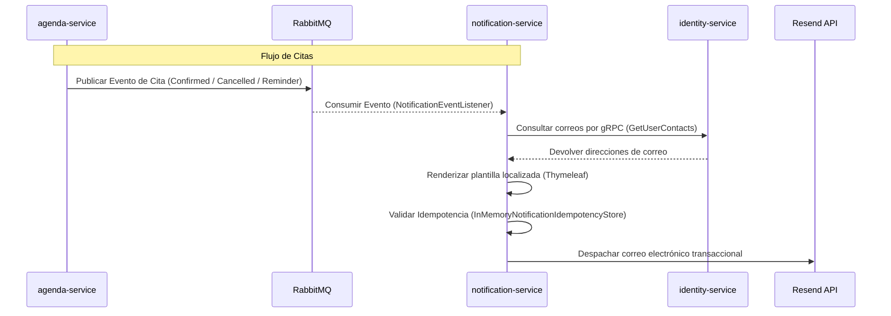

# ✉️ Microservicio: Notification Service

## 1. Propósito y Responsabilidades
El `healthcore-notification-service` es el encargado de la **Gestión y Envío de Notificaciones Transaccionales** del ecosistema. Su responsabilidad principal es escuchar eventos asíncronos publicados en RabbitMQ y despachar correos electrónicos estructurados al usuario final utilizando el SDK oficial de **Resend**.

Sigue una arquitectura limpia y desacoplada, asegurando que los otros microservicios no tengan que esperar síncronamente al proceso de envío de correos, mejorando la latencia de cara al usuario.

---

## 2. Stack Tecnológico Core
* **Lenguaje/Framework:** Java 21 + Spring Boot 3.x
* **Proveedor de Correo (Nube):** Resend (vía Resend SDK para Java)
* **Motor de Plantillas:** Thymeleaf (para renderizado dinámico de correos HTML en `src/main/resources/templates/`)
* **Localización:** Spring `MessageSource` bundles (`messages.properties` para Español/Default, `messages_en.properties` para Inglés)
* **Comunicaciones Internas:** gRPC Client para consultar al `identity-service` (resolución de IDs a correos electrónicos)
* **Mensajería (Entrada):** Spring AMQP (RabbitMQ) - Consumidor de eventos
* **Persistencia Temporal:** `InMemoryNotificationIdempotencyStore` (Deduplicación en memoria con TTL de 24 horas)

---

## 3. Flujo de Comunicación y gRPC
Dado que los eventos en HealthCore se diseñan bajo principios de DDD (Domain-Driven Design), los payloads solo contienen identificadores lógicos (`patientId`, `nutritionistId`) y evitan propagar datos personales de contacto para respetar los límites de contexto.



---

## 4. Control de Idempotencia y Deduplicación
Para mitigar reenvíos duplicados por re-conexiones de red en RabbitMQ, se utiliza un filtro de idempotencia (`IdempotentEmailSender`). 

Antes de realizar el despacho físico a la API de Resend, se calcula una clave única (`idempotencyKey`) y se almacena en memoria:
* **Citas Confirmadas:** `appointment-confirmed:{appointmentId}:{startTime}:{recipientRole}`
* **Citas Canceladas:** `appointment-cancelled:{appointmentId}:{startTime}:{recipientRole}`
* **Recordatorios de Citas:** `appointment-reminder:{appointmentId}:{startTime}:{recipientRole}`

Si el estado de la clave es `SUCCEEDED` dentro del período TTL (24 horas), el envío se omite de forma segura. Si está `IN_PROGRESS`, la entrega falla de inmediato para prevenir envíos concurrentes duplicados.

---

## 5. Eventos Consumidos (RabbitMQ Contracts)
Este servicio escucha activamente en los exchanges `healthcore.identity.events` y `healthcore.agenda.events`.

| Clase de Evento | Exchange | Routing Key | Cola Asociada | Propósito |
| :--- | :--- | :--- | :--- | :--- |
| `UserRegisteredEvent` | `healthcore.identity.events` | `identity.user.registered` | `welcome-email` | Envío de correo de bienvenida y código de verificación de 6 dígitos. |
| `PasswordResetRequestedEvent` | `healthcore.identity.events` | `identity.password.reset.requested` | `password-reset-email` | Envío del código temporal para recuperar la contraseña. |
| `AppointmentConfirmedEvent` | `healthcore.agenda.events` | `agenda.appointment.confirmed` | `appointment-confirmed-email` | Notificar al paciente y nutriólogo la confirmación de la cita. |
| `AppointmentCancelledEvent` | `healthcore.agenda.events` | `agenda.appointment.cancelled` | `appointment-cancelled-email` | Notificar la cancelación y liberación del slot. |
| `AppointmentReminderEvent` | `healthcore.agenda.events` | `agenda.appointment.reminder` | `appointment-reminder-email` | Recordatorio automático enviado 24 horas antes de la cita. |

---

## 6. Variables de Entorno Requeridas (`.env`)
```properties
# Configuración del Proveedor Resend
RESEND_API_KEY=re_1234567890abcdefEXAMPLEKEY
RESEND_FROM_EMAIL=no-reply@healthcore.example
RESEND_FROM_NAME=HealthCore

# Broker RabbitMQ
SPRING_RABBITMQ_HOST=rabbitmq
SPRING_RABBITMQ_PORT=5672
SPRING_RABBITMQ_USERNAME=healthcore
SPRING_RABBITMQ_PASSWORD=healthcore

# Cliente gRPC para Identity
GRPC_IDENTITY_TARGET=identity-service:9090
```
