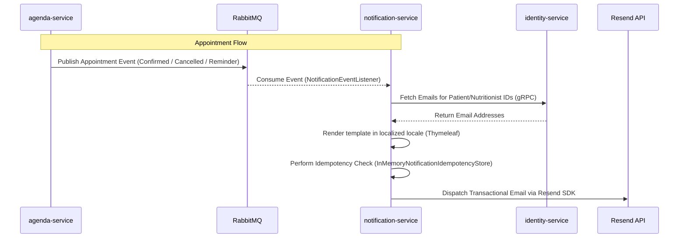

# Notification Service

## Overview
Notification service consumes asynchronous events from RabbitMQ and sends transactional emails via Resend. It follows clean architecture with a clear split between domain, application, and infrastructure layers.

## Responsibilities
- Send welcome emails on `UserRegisteredEvent` (local/admin users receive a 6-digit verification code; social users receive a welcome email).
- Send password reset codes on `PasswordResetRequestedEvent`.
- Send appointment confirmations, cancellations, and 24-hour reminders from agenda events.

---

## Architecture & Communication Flow



### 1. Instant Email Triggers
- **Appointment Confirmed:** Triggered immediately when a patient schedules an appointment in the `agenda-service`. The event `AppointmentConfirmedEvent` is published to the RabbitMQ exchange `healthcore.agenda.events` with routing key `agenda.appointment.confirmed`.
- **Appointment Cancelled:** Triggered immediately when an appointment is cancelled by either the patient or nutritionist in `agenda-service`. The event `AppointmentCancelledEvent` is published to the exchange `healthcore.agenda.events` with routing key `agenda.appointment.cancelled`.

### 2. Time-Based Reminders (24-Hour Lead Time)
- **Generation Mechanics:** 
  - The `agenda-service` hosts a background scheduler class: `AppointmentReminderScheduler`.
  - Every 24 hours (configured via `agenda.reminders.delay-ms`, defaulting to `86400000` ms), a `@Scheduled` task executes.
  - The scheduler calculates a time window starting at `now + leadTimeHours` (defaulting to 24 hours, configured via `agenda.reminders.lead-time-hours`) and ending 24 hours after that (`now + 48 hours`).
  - It queries the database for all appointments with `CONFIRMED` status starting within this window.
  - For each matching appointment, it publishes an `AppointmentReminderEvent` to the RabbitMQ exchange `healthcore.agenda.events` with routing key `agenda.appointment.reminder`.
- **Consumption & Dispatch:** 
  - `notification-service` consumes the reminder event, resolves target emails, and sends the reminder email.

### 3. Email Resolution & Rendering
- **Recipient ID to Email Mapping:**
  - Events published by the `agenda-service` only contain domain IDs (`patientId`, `nutritionistId`) to enforce domain boundaries.
  - Upon receiving the event, `notification-service` performs a synchronous **gRPC** query to `identity-service` (target configured via `GRPC_IDENTITY_TARGET`) to retrieve the email addresses.
- **Thymeleaf Template Rendering:**
  - Emails are rendered using Thymeleaf HTML templates (located under `src/main/resources/templates/`).
  - The email subject and fallback text body are localized according to the event's `locale` parameter using standard Spring `MessageSource` bundles (`messages.properties` for Spanish/Default, `messages_en.properties` for English).

---

## Idempotency & Deduplication

To prevent sending duplicate emails (e.g., in case of RabbitMQ network reconnections or message redeliveries), the system features an idempotency filter:
- Every use case constructs a unique `idempotencyKey` based on the event details:
  - Confirmed: `appointment-confirmed:<appointmentId>:<startTime>:<recipientRole>`
  - Cancelled: `appointment-cancelled:<appointmentId>:<startTime>:<recipientRole>`
  - Reminder: `appointment-reminder:<appointmentId>:<startTime>:<recipientRole>`
- Before dispatching, `IdempotentEmailSender` queries `InMemoryNotificationIdempotencyStore`.
- If the key is already marked as `SUCCEEDED` within the TTL (default 24 hours), the email dispatch is skipped.
- If it is `IN_PROGRESS`, the delivery fails fast to prevent concurrent duplicate delivery.

---

## Event Contracts

### Exchanges
- **Identity Exchange:** `healthcore.identity.events` (for registration and password reset)
- **Agenda Exchange:** `healthcore.agenda.events` (for appointment confirmations, cancellations, and reminders)

| Event Class | Exchange | Routing Key | Payload Structure |
| --- | --- | --- | --- |
| `UserRegisteredEvent` | `healthcore.identity.events` | `identity.user.registered` | `{ "userId": "UUID", "email": "x@x.com", "role": "PATIENT", "registeredAt": "ISO-8601", "emailVerificationRequired": true, "verificationCode": "123456", "verificationExpiresAt": "ISO-8601" }` |
| `PasswordResetRequestedEvent` | `healthcore.identity.events` | `identity.password.reset.requested` | `{ "email": "x@x.com", "resetCode": "123456", "expiresAt": "ISO-8601" }` |
| `AppointmentConfirmedEvent` | `healthcore.agenda.events` | `agenda.appointment.confirmed` | `{ "appointmentId": "UUID", "patientId": "UUID", "nutritionistId": "UUID", "startTime": "ISO-8601", "endTime": "ISO-8601", "locale": "es" }` |
| `AppointmentCancelledEvent` | `healthcore.agenda.events` | `agenda.appointment.cancelled` | `{ "appointmentId": "UUID", "patientId": "UUID", "nutritionistId": "UUID", "startTime": "ISO-8601", "locale": "es" }` |
| `AppointmentReminderEvent` | `healthcore.agenda.events` | `agenda.appointment.reminder` | `{ "appointmentId": "UUID", "patientId": "UUID", "nutritionistId": "UUID", "startTime": "ISO-8601", "locale": "es" }` |

---

## Configuration

Set these environment variables (do not hardcode secrets):
- `RESEND_API_KEY`: API Key for Resend email dispatch.
- `RESEND_FROM_EMAIL`: The sender email address.
- `RESEND_FROM_NAME`: The sender display name.
- `SPRING_RABBITMQ_HOST`: RabbitMQ host.
- `SPRING_RABBITMQ_PORT`: RabbitMQ port.
- `SPRING_RABBITMQ_USERNAME`: RabbitMQ username.
- `SPRING_RABBITMQ_PASSWORD`: RabbitMQ password.
- `GRPC_IDENTITY_TARGET`: Target host/port of the `identity-service` for email gRPC resolution.

---

## Testing Strategy

### 1. Unit Testing (Mockito)
Unit tests cover all core components, avoiding dependencies on external brokers:
- **Use Case Level:** Each use case (e.g. `SendAppointmentReminderEmailUseCaseTest`) mocks `EmailSender`, `UserDirectoryPort`, and `TemplateService` to verify correct business logic.
- **Idempotency Level:** `IdempotentEmailSenderTest` asserts that duplicate calls within TTL are filtered.
- **Messaging Bindings:** `NotificationEventListenerTest` uses reflection to verify that listener methods are bound to correct queue properties.
- **Scheduler Level:** `AppointmentReminderSchedulerTest` in `agenda-service` asserts that the scheduler queries the correct time range and publishes events.

#### Running Unit Tests
In `notification-service`:
```bash
# Using local Maven wrapper
./mvnw test
```
In `agenda-service`:
```bash
# Using local Maven wrapper
./mvnw test
```
Via Docker Compose (clean test execution):
```bash
docker-compose run --rm notification-service ./mvnw test
```
